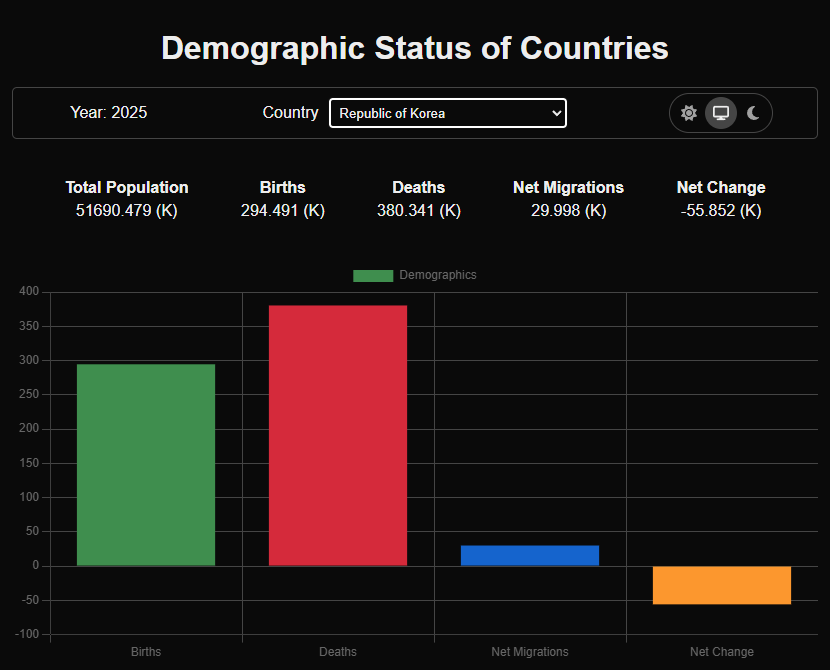

# demographic-status-of-countries
Patika Intermediate Frontend Web Development Path Certification Task
 Demographic Status of Countries
 Redux Toolkit, TypeScript, Next.js 16

Display: <https://demographic-status-of-countries.netlify.app/>

